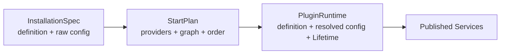

# Dougong 架构设计

Dougong 是纯 JavaScript/TypeScript 的应用运行时内核。它不是模块加载器、DI 容器、事件总线和响应式库的简单拼盘，而是一套围绕“能力声明 + 组合 + 所有权”的统一插件模型。

当前阶段允许 breaking change，因此设计优先保证语义正确和长期一致，不为旧的内部实现保留兼容旁路。

## 一条总原则

同一抽象层、同一种语义，只保留一个正式入口。高层语法糖可以提供更贴近业务的名字，但必须落到 Core 的原子能力，不能拥有第二套生命周期、依赖图或事件机制。

| 语义 | 唯一入口 | 不引入的平行概念 |
| --- | --- | --- |
| 稳定能力依赖 | `requires` / `provides` + `service()` | 容器查找、全局 locator、隐式注入 |
| 可选能力 | `optional(service)` | 第二套 optional getter |
| 开放注册点 | `extension()` + `ctx.contribute()` | 每个领域各造一套 registry |
| 瞬时消息 | `event()` + `ctx.on()` / `ctx.emit()` | sync emit、fire-and-forget emit 两套总线 |
| 当前值与派生值 | `signal()` / `computed()` / `batch()` | hook、依赖数组、隐式 effect 系统 |
| 资源所有权 | `cleanup()` / `lifetime()` / `spawn()` / `observe()` | start/stop hook 矩阵、手写销毁列表 |
| 插件变更 | `PluginHandle.update()` / `remove()` | 另一套 reload 或 patch API |

这里的“原子”不是 API 越少越好，而是每个原子只有一个清楚的职责，并且可以无损组合。

## 五个正交原语

### Service：稳定、唯一、决定依赖顺序

Service 表达“插件运行前必须拿到的能力”。同一应用内，一个 Service 只能有一个提供者。它形成有向依赖图，因此 Dougong 可以推导启动顺序、逆序停止顺序，以及插件变化时需要重启的最小传递闭包。

Service 只能由 `setup()` 的返回值发布。禁止在 `setup()` 中再调用一套 `provide()`，这样声明、类型和运行时发布不会分叉。

### Extension：动态、多源、不制造重启依赖

Extension 表达菜单、命令、路由、面板、编解码器等开放注册点。多个插件可以贡献带稳定 key 的值，消费者得到实时 `ReadonlyMap`。

贡献由当前 Lifetime 自动拥有；插件停止时贡献自动撤销。贡献变化是数据变化，不是 Service 图变化，因此消费者无需重启。

### Event：瞬时事实

Event 不保存状态。`emit()` 始终异步：并行调用当前监听器、等待全部结束、聚合全部错误。

需要后台发送时不增加 `emitDetached()`，而是组合已有原子：

```ts
ctx.spawn(() => ctx.emit(INDEX_INVALIDATED, { path }))
```

### Signal：状态计算，不负责副作用生命周期

Core 只提供 `signal`、`computed`、`batch`。没有类似 React hooks 的调用顺序规则，没有依赖数组，也不把 Solid 的 `createEffect` 或 Effect-TS 变成插件基础模型。

`ReadonlySignal` 是 Dougong 自己的响应式节点，能被 `computed()` 自动跟踪。`Readable` 只是结构协议：

```ts
interface Readable<T> {
  get(): T
  subscribe(listener: () => void): Disposable
}
```

外部 store 可以直接交给 `ctx.observe()`。它不会被伪装成可自动跟踪的 Dougong Signal，从类型层面避免“看起来能组合、实际上不更新”的承诺。

### Lifetime：统一所有副作用的所有权

监听器、贡献、后台任务、观察过程、子 Lifetime 和普通 cleanup 最终都归属于 Lifetime。释放顺序是 LIFO，释放具有幂等性，并聚合错误。

状态机是 `active → disposing → disposed`：

- `active` 可以获取和登记资源；
- `disposing` 不允许再登记新资源，但 cleanup 可以发送最终事件；
- `disposed` 不允许再执行上下文操作。

`observe(source, observer)` 是明确的高层组合：每次值变化时先销毁旧的子 Lifetime，再为新值建立一个子 Lifetime。它解决的是“某个当前值对应一组资源”的常见问题，而不是一个无边界的全局 effect。

## 运行时分成两层

旧式实现很容易把“已安装插件”和“正在运行的插件”揉成一个可变对象，更新时只能全停全启。Dougong 将它们彻底分开：



- `InstallationSpec` 是下一次计划使用的不可变声明；
- `StartPlan` 是一次完整校验后的依赖图；
- `PluginRuntime` 是当前真正运行的实例；
- Service 绑定记录提供者实例，停止旧实例时不会误删新定义的 Service。

这使 breaking update 不再是给“全停全启”加条件，而是直接以图差异为基础实现。

## 在线变更算法

安装、更新、删除、启动、停止都进入同一条串行命令队列。命令执行时读取真实应用状态，不使用一个容易与现实脱节的 `desiredStarted` 布尔值。

在线变更按以下步骤执行：

1. 保存旧安装声明、旧解析配置和旧依赖图；
2. 在声明层应用变更并构建新图；
3. 同时沿旧图和新图计算“变化节点 + 所有传递依赖者”的并集；
4. 在停止任何实例之前，验证新图和所有受影响配置；
5. 按旧图逆序只停止受影响实例；
6. 按新图拓扑顺序只启动受影响实例；
7. 若启动失败且部分新实例已被完整释放，按旧计划恢复同一闭包；
8. 若任意 cleanup 不完整，或恢复失败，停止整个应用并进入 `idle`，绝不冒险重复启动可能仍残留资源的实例，也不保留一个名义 active、实际残缺的状态。

它保证的是受控的生命周期变更和失败恢复，不假装提供数据库式隔离。插件对外部系统产生的不可逆副作用仍应由插件自身避免，或通过幂等协议处理。

## 为什么启动暂时串行

依赖图已经具备并行启动互不依赖节点的条件，但 Core 当前保持确定性的串行拓扑启动。并行调度会引入并发上限、失败取消、日志顺序和回滚竞态等额外策略；在有真实性能数据前，这些不应污染基础模型。未来可以在不改变插件 API 的前提下替换计划执行器。

## 前端、后端与桌面如何组合

Core 不认识 React、Vue、HTTP、数据库、窗口或文件系统。领域包只需定义契约和少量适配器。

桌面应用可以这样映射：

- `WINDOWS`、`FILESYSTEM`、`STORAGE`：Service；
- `COMMANDS`、`MENUS`、`PANELS`、`SETTINGS_PAGES`：Extension；
- `WORKSPACE_OPENED`、`THEME_CHANGED`：Event；
- 当前主题、连接状态、活动工作区：Signal；
- 文件监听、进程、快捷键、WebSocket：Lifetime。

前端应用可以将路由、导航项、组件插槽做成 Extension，把鉴权和请求客户端做成 Service。后端可以将路由、任务处理器、序列化器做成 Extension，把数据库、缓存和队列做成 Service。

因此，这个内核足以承载 Planet 或 Lynx Desktop 的“插件能力模型”，但下面这些应属于更高层包，而不是塞进 Core：

- manifest、版本范围和插件发现；
- `import()` / npm / 本地目录加载；
- 权限、签名、信任和沙箱；
- Worker、iframe、进程间 RPC；
- UI 框架绑定和领域专用语法糖；
- 插件市场、安装和升级策略。

高层包可以把 manifest 中的命令声明编译成 `ctx.contribute(COMMANDS, ...)`，但运行时仍然只有 Extension 这一条路径。

## 当前刻意不做的事情

- 不把 Application 暴露成全局 Service Locator；
- 不用 Proxy 隐藏依赖来源；
- 不提供 class 继承树或装饰器协议；
- 不提供两套事件错误语义；
- 不让 Signal 自动执行资源副作用；
- 不在没有数据前加入并行启动调度器；
- 不在 Core 中绑定具体模块加载和安全模型。

这些边界让 Dougong 保持足够小，同时为上层组合保留足够大的表达空间。
